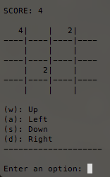

# 2048Game
This repo holds the code for my implementation of the game 2048.  The game uses basic w,a,s,d keys to manipulate the playing board.  I have included screenshots below to show what the game looks like.  The code includes a makefile so that the only steps to build and run the program is fork the repo and type the word make followed by ./2048.exe.  I decided to use C++ because of the performance boosts that C++ allows during computations.

# Screenshots

